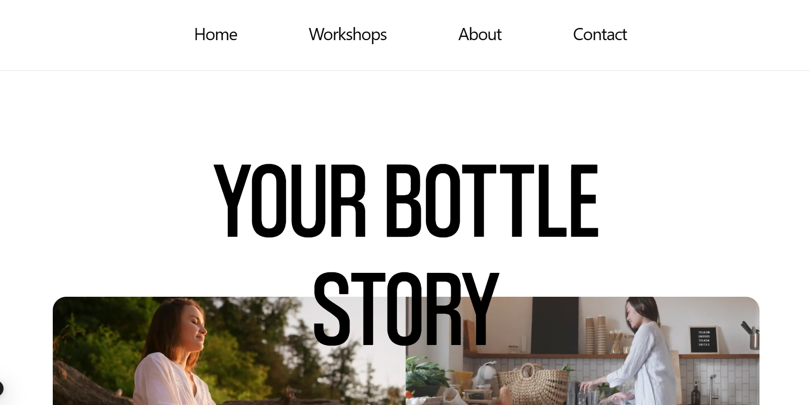
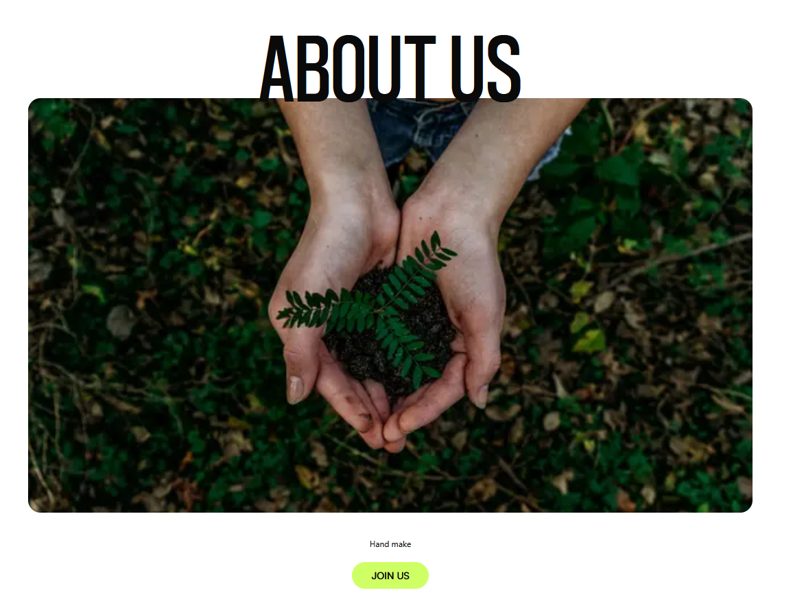
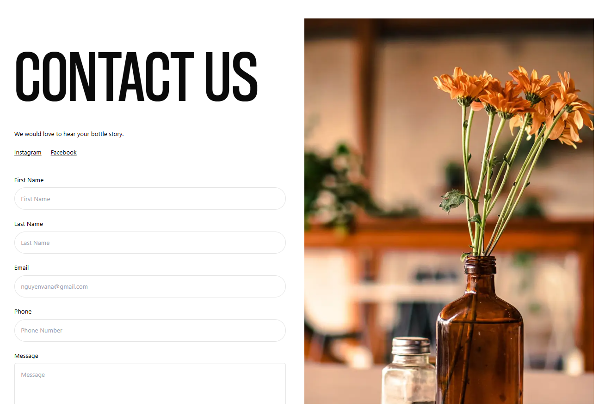

# Your Bottle Story 🍾

Website giới thiệu thương hiệu **Your Bottle Story** — một cửa hàng/cộng đồng chuyên về các
sản phẩm **thủ công và tái chế** (bình hoa độc đáo, nến handmade, đồ thủ công bền vững…).
Trang web vừa là nơi trưng bày sản phẩm, vừa là **bản demo kỹ thuật về hiệu ứng scroll animation
với GSAP** (parallax, pin/sticky section, scroll-scrubbed reveal).

Dự án được xây dựng trên **Next.js 15 (App Router)** với **TypeScript**, **Tailwind CSS** và đặc
biệt chú trọng vào trải nghiệm tương tác khi cuộn trang thông qua **GSAP + ScrollTrigger**.

---

## ✨ Tính năng chính

- 🏠 **Trang chủ** gồm nhiều section: `Hero`, `Register`, `Coaches`, `Locations`, `Rally`, `FAQ`
  — với hiệu ứng **sticky/pinning + parallax** khi Register dán đỉnh viewport và Coaches đè lên trên.
- 🎨 **Hiệu ứng GSAP ScrollTrigger**: parallax, pin section, `scrub`, reveal theo stagger khi cuộn.
- 👥 **Trang About**: giới thiệu về đội ngũ và câu chuyện thương hiệu.
- 📬 **Trang Contact**: form liên hệ + mạng xã hội.
- 🛠️ **Trang Workshops / Activities**: trưng bày hoạt động, bộ sưu tập sản phẩm với hiệu ứng hover
  và xem phóng to hình ảnh full-screen.
- 🧭 Header/Footer responsive, menu mobile, nút cuộn lên đầu trang (Scroll to top).
- 🔤 Sử dụng các font tùy chỉnh **Coolvetica** và **Satoshi**.

---

## 🖼️ Ảnh minh hoạ

| Trang chủ (Homepage) | Trang About | Trang Contact |
| :---: | :---: | :---: |
|  |  |  |

---

## 🧰 Tech Stack

| Công nghệ | Mô tả |
| :-------- | :---- |
| **Next.js 15** | Framework React, sử dụng App Router |
| **React 19** | Thư viện UI |
| **TypeScript** | Ngôn ngữ lập trình với static types |
| **Tailwind CSS** | Utility-first CSS + `tailwindcss-animate` |
| **GSAP 3** | Animation engine (`gsap`, `@gsap/react`, `ScrollTrigger`) |
| **Radix UI** | Primitives UI (`@radix-ui/react-accordion`, `react-toast`) |
| **NextUI** | `@nextui-org/accordion` |
| **lucide-react** | Icon library |
| **usehooks-ts** | React hooks tiện ích (vd: `useWindowSize`) |
| **CVA / clsx / tailwind-merge** | Quản lý className & variants |
| **Coolvetica / Satoshi** | Fonts tùy chỉnh |

---

## 🚀 Bắt đầu

Cài đặt dependencies:

```bash
npm install
# hoặc
yarn
# hoặc
pnpm install
# hoặc
bun install
```

Chạy development server (mặc định ở cổng **3001**):

```bash
npm run dev
# hoặc
yarn dev
# hoặc
pnpm dev
# hoặc
bun dev
```

Mở [http://localhost:3001](http://localhost:3001) trên trình duyệt để xem kết quả.

Build cho production:

```bash
npm run build
npm run start
```

Chạy lint:

```bash
npm run lint
```

---

## 📁 Cấu trúc thư mục chính

```
├── app/                    # App Router pages (home, about, contact, workshops, activities)
├── components/
│   ├── elements/           # Button, Input, Form, TextGsap, ScrollToTop...
│   ├── layouts/            # Header, Footer, Container, Section
│   ├── pages/              # Sections của từng page (home-page, activities)
│   └── ui/                 # Accordion, Toast
├── data/mock.json          # Dữ liệu mẫu (menu, coaches, locations, faqs)
├── hooks/                  # Custom hooks với GSAP
├── lib/
├── public/                 # Images, fonts, svg, videos
├── types/
└── demo/                   # Ảnh minh hoạ cho README
```

---

## 🖥️ Link hữu ích

- [Next.js Documentation](https://nextjs.org/docs)
- [Learn Next.js](https://nextjs.org/learn)
- [GSAP](https://gsap.com/) & [ScrollTrigger](https://gsap.com/docs/v3/Plugins/ScrollTrigger/)
- [Tailwind CSS](https://tailwindcss.com/docs)
- [Deploy trên Vercel](https://nextjs.org/docs/app/building-your-application/deploying)
